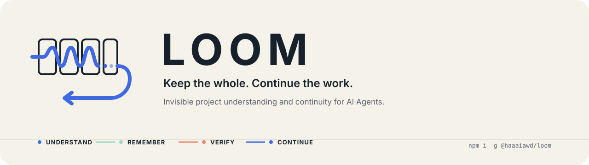

<p align="center"><strong>English</strong> · <a href="README.zh-CN.md">简体中文</a></p>

<p align="center">
  
</p>

<p align="center">
  <a href="https://www.npmjs.com/package/@haaaiawd/loom"></a>
  
  <a href="LICENSE"></a>
</p>

<p align="center"><strong>The human talks to the Agent. LOOM helps the Agent remember, understand, and continue.</strong></p>

LOOM is invisible project-understanding and continuity infrastructure for AI Agents. It supports
any work that can be materially advanced through code or command-line tools: software, operations,
research workflows, office automation, data work, and highly personalized projects.

The human does not learn a framework or operate a CLI. They describe what they want, answer useful
questions, disagree, delegate decisions, and watch the work become real. The Agent uses LOOM in the
background to preserve the whole project across context compression, new sessions, and implementation.

<table>
  <tr>
    <td width="33%"><strong>Whole over fragments</strong><br>Keep the result, decisions, systems, and unknowns connected.</td>
    <td width="33%"><strong>Expertise over costumes</strong><br>Compile project-specific professional judgment, not decorative expert personas.</td>
    <td width="33%"><strong>Proof over ceremony</strong><br>Use independent handoff, exact done conditions, and disk evidence.</td>
  </tr>
</table>

## The loop


LOOM has three explicit feedback loops: understanding converges on the whole project; a fresh Keeper
tests the frozen handoff and returns concrete gaps; restartable Tasks carry implementation and evidence
across interruptions. A failed Keeper does not become a warning that everyone politely ignores—it sends
the project back to the exact source that needs repair, then requires a changed digest and a new Keeper.

The loop is adaptive. LOOM does not provide a universal questionnaire, fixed professional roles, or
a mandatory phase ritual. The Agent keeps clarifying while unknowns could materially change the whole.
It proceeds when the remaining uncertainty is reversible and local, or when the human explicitly asks
to skip after hearing the concrete cost.

## Project truth on disk

An initialized project contains one small semantic backbone:

```text
.loom/
├── PROJECT.md          concise entry point and map of the current whole
├── DECISIONS.md        concise history when important decisions supersede earlier ones
├── design/             product, experience, system, contract, verification, operations, or research docs
├── capabilities/       one project-specific dossier per recognizable professional field
├── state.json          confirmed facts, assumptions, unresolved questions, Keeper status
├── tasks.json          broad Work Map plus the detailed active horizon
└── eval/               optional Evil Eval scenarios for testing LOOM itself
```

Small projects may need few design documents; large projects may need many. A consequential subsystem,
experience, interface, contract, or operational concern gets its own document when a fresh Agent must
understand or verify it independently. `PROJECT.md` maps the whole instead of becoming a thousand-line attic.

### Capability dossiers

A dossier exists only when specialist knowledge would change a question, design choice,
implementation, risk, or verification method. Each dossier represents one recognizable professional
field—such as UI/UX design, visual art direction, game design, psychology, security, or distributed
systems. Different fields remain separate even when tightly coupled; their synthesis belongs in the
design document whose decision they jointly shape. A task technique such as triage, ranking, parsing,
or caching is not allowed to masquerade as the project's entire capability surface.

### Work Map and Task

The Work Map may be hundreds or thousands of lines. It is stored, searched, and revised on disk; it
is not injected into every model context. Planning begins broadly, while detailed steps are compiled
only for the active horizon.

A Task is not a miniature bureaucracy. It is the smallest restartable checkpoint that tells a fresh
Agent:

- what observable result to create;
- what proves completion;
- what must not be damaged;
- which project and capability documents matter;
- what has happened, what is happening, and what comes next;
- which evidence already exists and which exact done condition it proves.

## Agent quick start

Install the CLI:

```bash
npm install --global @haaaiawd/loom
loom --version
```

Or install from the repository during development:

```bash
npm install --global .
loom --version
```

Inside a project, the Agent runs:

```bash
loom init
loom context
```

The Agent edits `.loom/PROJECT.md`, design documents, and capability dossiers as human-readable project truth. Structured
writes use JSON files so long content remains auditable and shell quoting does not corrupt it:

```bash
loom record --json-file understanding-update.json
loom design add product --title "Product definition" --kind product
loom design add local-analysis --title "Local analysis system" --kind system
loom design add acceptance --title "Vertical-slice verification" --kind verification
loom capability add ui-ux-design --title "UI/UX design"
loom capability add behavioral-psychology --title "Behavioral psychology"
loom task plan --json-file initial-work-map.json
loom project ready
```

At the transition to material execution, open a fresh Agent thread and give it one short instruction:

```text
Run loom keeper prompt in this project and follow it. Decide whether you can responsibly start.
```

If Keeper returns `needs_revision` or `blocked`, those exact gaps reappear in `loom context`. The Agent
repairs the relevant project, design, capability, or Task source, prepares a changed digest, and opens a
different fresh Keeper. If the host cannot create a subagent, the human can open a new window and use the
same sentence. After the one-time handoff passes, the execution Agent starts and maintains Tasks normally:

```bash
loom task next
loom task start TASK-001
loom context
loom task update TASK-001 --json-file progress.json
loom task block TASK-001 --json-file block.json
loom task reopen TASK-001
loom task reopen TASK-001 --reason "Prior completion evidence was disproven"
loom task done TASK-001 --json-file evidence.json
```

Completion is deliberately explicit:

```json
{
  "evidence": ["npm test: 21 passed, 0 failed"],
  "checks": [
    {
      "criterion": "The exact done_when sentence from the Task.",
      "evidence": ["The command, artifact, or observation that proves this criterion."]
    }
  ]
}
```

Run `loom --help` for the complete command surface. Run `loom check` for structural health. Run
`loom prompts` to print every cognitive message LOOM can inject: the stable collaboration core,
runtime protocol, dynamic state layer, all document templates, Keeper prompt, eval conditions, judge
prompt, and their composition order. See the [prompt and message catalog](docs/PROMPT_CATALOG.md).

## What LOOM deliberately removed

LOOM 2 replaces the v1 chain of Doctrine, Vision, Capability Graph, Impact Gate, Intent Map, Expertise
Pack, Atelier, Quality Arena, per-Intent Keeper, and Atlas with one adaptive understanding loop, a
scalable graph of design documents, separate professional-field dossiers, one Work Map, and one
restartable Task contract.

The valuable ideas remain: project judgment, external professional capability, authored choices,
observable completion, context isolation, and evidence. They no longer require separate roles and gates.

## Proving that LOOM helps

`loom eval scaffold --json-file scenario.json` creates an Evil Eval scenario with equal model, tools,
workspace, user facts, and budget across two conditions. The only intended difference is the availability
of LOOM. Runs are repeated, context is forcibly reset, outputs are blinded and order-swapped, and ceremony,
user burden, time, and token cost are penalized alongside quality. See [EVIL_EVAL.md](EVIL_EVAL.md).


## Development

```bash
npm test
```

The v2 test suite exercises the complete loop, including a 250-Task Work Map, context selection,
superseding decisions, scalable design documents, professional-field separation, capability compilation,
multi-attempt Keeper revision, stale digest and duplicate-run
rejection, exact-file Task start, block/reopen including disproven completion, per-done-condition evidence,
and Evil Eval controls. See the
[complete UX and loop specification](docs/UX_FLOW.md).

## Documentation

| Read this | When you need |
| --- | --- |
| [System design](design.md) | The architecture, storage model, invariants, and command contracts |
| [UX and loop specification](docs/UX_FLOW.md) | Every human, Agent, LOOM, Keeper, and Task transition |
| [Prompt and message catalog](docs/PROMPT_CATALOG.md) | Every message LOOM injects and how the layers compose |
| [Evil Eval protocol](EVIL_EVAL.md) | A controlled framework-vs-no-framework comparison |
| [Changelog](CHANGELOG.md) | What changed in LOOM 2 |

Editable Draw.io sources live beside both flow diagrams in [`docs/`](docs/).
