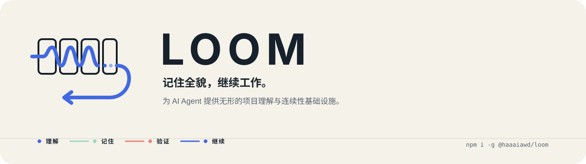
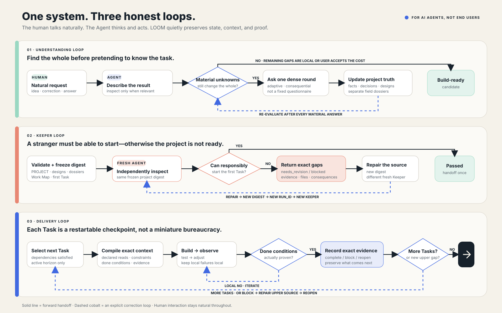
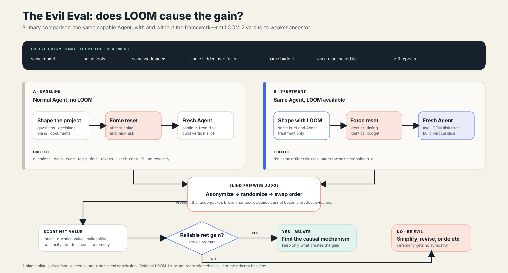

<p align="center"><a href="README.md">English</a> · <strong>简体中文</strong></p>

<p align="center">
  
</p>

<p align="center">
  <a href="https://www.npmjs.com/package/@haaaiawd/loom"></a>
  
  <a href="LICENSE"></a>
</p>

<p align="center"><strong>人只需要和 Agent 自然聊天。LOOM 在背后帮助 Agent 记住、理解，并继续工作。</strong></p>

LOOM 是为 AI Agent 准备的、隐形的项目理解与连续性基础设施。凡是能够通过代码或命令行获得实质推进的工作——软件、运维、科研流程、办公自动化、数据处理，以及高度个性化的项目——都在它的能力边界内。

用户不需要学习一套框架，也不需要亲自操作 CLI。他只需要描述想要什么、回答真正有价值的问题、提出异议、把某些判断交给 Agent，然后看着结果逐渐成为现实。Agent 在后台使用 LOOM，让项目全貌在上下文压缩、会话切换和长期施工中保持连续。

<table>
  <tr>
    <td width="33%"><strong>全貌，而不是碎片</strong><br>让结果、决策、系统与未知始终彼此连接。</td>
    <td width="33%"><strong>专业判断，而不是角色扮演</strong><br>编译项目专属的领域能力，而不是装饰性的专家人设。</td>
    <td width="33%"><strong>证据，而不是仪式</strong><br>通过独立交接、精确完成条件与磁盘证据证明结果。</td>
  </tr>
</table>

## 整体闭环



LOOM 有三个明确的反馈环：理解环不断收敛到项目全貌；陌生 Keeper 检查被冻结的交接内容，并返回具体缺口；可恢复的 Task 则带着实现状态与证据穿过中断继续向前。Keeper 不通过时，结果不会沦为一条大家礼貌看过、然后继续开工的警告——项目必须回到真正有问题的源文件修复，形成新的 digest，再交给另一个全新的 Keeper。

这个闭环是自适应的。LOOM 不提供万能问卷、固定专家角色或强制阶段仪式。只要某个未知仍可能改变项目全貌，Agent 就继续澄清；当剩余不确定性已经局部且可逆，或用户在得知具体代价后明确要求跳过，Agent 才继续向前。

## 磁盘上的项目事实

初始化后的项目只有一条小而稳定的语义骨架：

```text
.loom/
├── PROJECT.md          项目全貌的简洁入口与索引
├── DECISIONS.md        重要决策被推翻或替代时的简洁历史
├── design/             产品、体验、系统、契约、验证、运作或研究文档
├── capabilities/       每个可识别专业领域一份项目专属能力卷宗
├── state.json          已确认事实、假设、未决问题与 Keeper 状态
├── tasks.json          广度 Work Map 与当前活跃施工地平线
└── eval/               可选的 Evil Eval 场景，用于检验 LOOM 自身
```

小项目可以只有少量设计文档，大项目也可以拥有很多。当一个重要子系统、体验、接口、契约或运作问题需要被陌生 Agent 独立理解或验证时，它就应拥有自己的文档。`PROJECT.md` 负责映射全貌，而不是慢慢长成一个千行杂物间。

### 能力卷宗

只有当某种专业知识会改变问题、设计选择、实现方式、风险或验证方法时，才需要建立能力卷宗。每份卷宗代表一个可被正常识别的专业领域，例如 UI/UX 设计、视觉美术、游戏化设计、心理学、安全或分布式系统。

即使多个领域紧密耦合，也应保持彼此独立；它们的综合判断写入共同参与塑造的设计文档。分诊、排序、解析或缓存之类的任务技巧，不能伪装成整个项目的专业能力边界。

### Work Map 与 Task

Work Map 可以有几百甚至几千行。它被存储、搜索并持续修订在磁盘上，不会被塞进每一次模型上下文。规划先获得足够广度，只有当前活跃地平线才会被编译成详细步骤。

Task 不是微型官僚流程。它是最小的、可以在中断后恢复的施工检查点，足以告诉一个陌生 Agent：

- 要产生什么可观察结果；
- 什么证据能够证明完成；
- 哪些东西绝不能被破坏；
- 当前需要读取哪些项目文档与能力卷宗；
- 之前发生了什么、现在在做什么、接下来是什么；
- 已有哪些证据，以及它们分别证明了哪一条精确完成条件。

## Agent 快速开始

安装 CLI：

```bash
npm install --global @haaaiawd/loom
loom --version
```

开发时也可以直接从仓库安装：

```bash
npm install --global .
loom --version
```

进入项目后，Agent 运行：

```bash
loom init
loom context
```

当存在活跃 Task 时，`loom context` 还会恢复一段紧凑的执行协议：先把 Task 与当前工作区和版本控制状态校准，编辑前检查相关测试，根据风险和精确的 `acceptance` 条件选择证据，在重要交接点写回 `completed/current/next`，在里程碑向人类展示真实可运行的东西，最后只用可复现证据关闭 Task。它不会为了形式感强迫所有工作都写一个测试或开一个 PR。

### 无人值守与 benchmark 运行

当人类不可达时，LOOM 不会凭空编造一次用户对话。向上下文编译器说明人类通道不可用后，Agent 会依次检查工作区和工具、仅在任务许可时研究客观外部事实，然后记录有边界的假设并选择可逆方案；若需要不可逆、高风险或有实质成本的授权，则阻塞。网络搜索永远不能替代用户的意图、偏好或许可。

```bash
loom context --human-channel unavailable
```

Benchmark runner 可以通过外部 sidecar 将 LOOM 状态放在评分工作区之外；**每一条** LOOM 命令都要带同一个状态目录。Task 中的 `.loom/PROJECT.md` 等虚拟引用仍能使用，但 `init` 不会在被评分工作区写入 `.loom/` 或 `AGENTS.md`。

```bash
loom init --state-dir /runner/run-001/loom-state
loom context --state-dir /runner/run-001/loom-state --human-channel unavailable
```

Agent 将 `.loom/PROJECT.md`、设计文档和能力卷宗作为人类可读的项目事实维护。结构化写入通过 JSON 文件完成，让长内容可以审计，也避免 shell 引号损坏数据：

```bash
loom record --json-file understanding-update.json
loom design add product --title "Product definition" --kind product
loom design add local-analysis --title "Local analysis system" --kind system
loom design add acceptance --title "Vertical-slice verification" --kind verification
loom capability add ui-ux-design --title "UI/UX design"
loom capability add behavioral-psychology --title "Behavioral psychology"
loom task plan --json-file initial-work-map.json
loom project ready
```

准备从项目成型进入实质施工时，打开一个全新的 Agent 线程，只给它一句简短指令：

```text
Run loom keeper prompt in this project and follow it. Decide whether you can responsibly start.
```

如果 Keeper 返回 `needs_revision` 或 `blocked`，这些具体缺口会重新出现在 `loom context` 中。Agent 修复对应的项目、设计、能力或 Task 源文件，生成发生变化的新 digest，再打开另一个全新的 Keeper。若宿主不支持子代理，用户可以新开一个窗口并使用同一句提示词。

一次性交接通过后，施工 Agent 正常启动并维护 Task：

```bash
loom task next
loom task start TASK-001
loom context
loom task update TASK-001 --json-file progress.json
loom task block TASK-001 --json-file block.json
loom task reopen TASK-001
loom task reopen TASK-001 --reason "Prior completion evidence was disproven"
loom task done TASK-001 --json-file evidence.json
```

完成条件被刻意设计得非常明确：

```json
{
  "evidence": ["npm test: 20 passed, 0 failed"],
  "acceptance_results": [
    {
      "criterion": "The exact acceptance criterion from the Task.",
      "evidence": ["The command, artifact, or observation that proves this criterion."]
    }
  ]
}
```

运行 `loom --help` 查看全部命令，运行 `loom check` 检查结构健康度。`loom prompts` 会打印 LOOM 可能注入的全部认知消息：稳定协作核心、运行时协议、动态状态层、所有文档模板、Keeper 提示词、Eval 条件、裁判提示词，以及它们的组合顺序。详见[提示词与消息目录](docs/PROMPT_CATALOG.md)。

## LOOM 刻意删除了什么

LOOM 2 用一个自适应理解环、可扩展的设计文档图、彼此独立的专业领域卷宗、一张 Work Map 和一个可恢复的 Task 契约，替代了 v1 中 Doctrine、Vision、Capability Graph、Impact Gate、Intent Map、Expertise Pack、Atelier、Quality Arena、逐 Intent Keeper 与 Atlas 组成的漫长链条。

真正有价值的部分仍然保留：项目判断、外部专业能力、有作者性的选择、可观察完成、上下文隔离与证据。它们不再需要一连串独立角色和关卡才能成立。

## 证明 LOOM 真的有用

`loom eval scaffold --json-file scenario.json` 会创建一个 Evil Eval 场景。在两个条件中，模型、工具、工作区、人类通道可用性、用户事实和预算完全相同；唯一预期差异是能否使用 LOOM。实验会重复运行、强制重置上下文、匿名并交换产物顺序，同时把仪式成本、用户负担、时间和 token 消耗与质量一起计分。详见 [EVIL_EVAL.md](EVIL_EVAL.md)。



## 开发

```bash
npm test
```

v2 测试套件（20 个端到端测试）覆盖完整闭环，包括 250 个 Task 的 Work Map、上下文选择、决策替代历史、可扩展设计文档、专业领域分离、能力编译（含 source 引用校验）、多轮 Keeper 修订（含 auto-pass）、陈旧 digest 与重复 run 拒绝、精确文件级 Task 启动、阻塞与重开（包括完成证据被推翻）、逐 acceptance 条件证据、交付物覆盖、决策记录与受影响 Task 警告，以及 Evil Eval 的控制变量。详见[完整 UX 与闭环规范](docs/UX_FLOW.md)。

## 文档

| 文档 | 适合在什么时候阅读 |
| --- | --- |
| [系统设计](design.md) | 了解架构、存储模型、不变量与命令契约 |
| [UX 与闭环规范](docs/UX_FLOW.md) | 了解用户、Agent、LOOM、Keeper 与 Task 的全部转换 |
| [提示词与消息目录](docs/PROMPT_CATALOG.md) | 检查 LOOM 注入的所有消息及其组合方式 |
| [Evil Eval 协议](EVIL_EVAL.md) | 进行有框架与无框架的受控比较 |
| [更新记录](CHANGELOG.md) | 了解 LOOM 2 的变化 |

两张流程图的可编辑 Draw.io 源文件与图片放在同一个 [`docs/`](docs/) 目录中。
