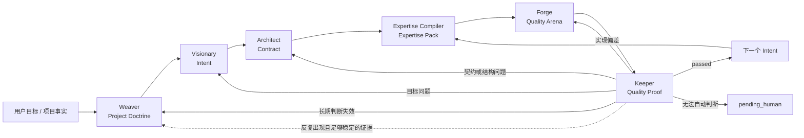
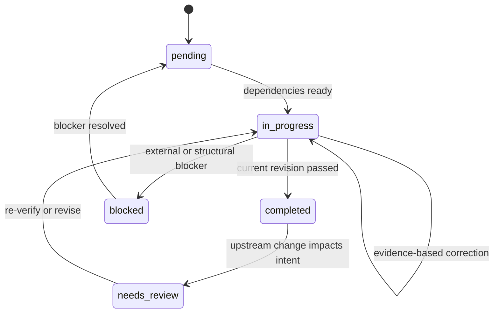

# LOOM 认知飞轮设计

> 状态：Proposed
> 设计对象：LOOM 的提示词架构、上下文注入、专业能力装配、Intent Loop 与验证回流
> 本文件是产品与系统设计稿，不作为运行时提示词全文注入。

---

## 0. 设计结论

LOOM 的目标不是让 Agent 扮演一组角色，而是让 Agent 在每个阶段获得恰当的
判断权、专业能力、项目事实和反馈信号，持续推进直到真实结果闭合。

LOOM 的核心链路定义为：

```text
Doctrine → Intent → Contract → Expertise Compiler
→ Quality Arena → Quality Proof → Reflow
```

前三段决定为什么做、做什么和不能破坏什么；后三段决定凭什么专业、为什么选择这个
方案，以及如何证明它值得交付。后三段合称 **LOOM Quality Engine**。普通任务会自然
缩短 Arena，但不需要切换到另一套架构。

对应含义：

| 环节 | 回答的问题 | 主要负责人 |
|---|---|---|
| Doctrine | 这个项目长期相信什么，怎样判断好坏？ | Weaver |
| Intent | 为什么要改变，最终应产生什么结果？ | Visionary |
| Contract | 如何拆分、依赖、约束和验证？ | Architect |
| Expertise Compiler | 当前任务需要装配哪些真实专业能力？ | Forge / 动态能力层 |
| Quality Arena | 哪个方案最值得实现，如何把它做完整？ | Forge |
| Quality Proof | 结果是否完成；若声称提升，是否真的胜过基线？ | Keeper |
| Reflow | 问题属于哪一层，应该回到哪里修正？ | CLI + 对应角色 |

核心决策：

1. 保留 Weaver、Visionary、Architect、Forge、Keeper 五个角色。
2. 不增加“专家角色”；Expertise Compiler 按任务生成临时 Expertise Pack。
3. 将 `loom activate` 从 Markdown 拼接器演进为 Context Pack 编译器。
4. 将“完成契约”和“质量契约”分开，约束是地板，不是天花板。
5. 使用内外双循环：内循环完成 Intent，外循环演进项目哲学。
6. 提示词负责判断和行动接口；状态、验证闭合、版本与重试上限由程序保证。
7. 角色切换不等于记忆清除；独立验证必须依赖新的 Agent thread 或等价隔离。
8. Quality Arena 对明确任务直接实现，对质量任务比较机制不同的候选，不设置固定档位。
9. “质量提升”是强声明：没有基线相对证据和稳定性证据，就只能说“完成了修改”。
10. Quality Proof 只把重复、可归因且有外部结果支持的方法晋升为长期能力。

---

## 1. 设计背景

### 1.1 当前系统已经具备的优势

LOOM 已经拥有一套有生命力的骨架：

- Weaver 建立项目哲学，而不是让所有项目共享一套僵硬规则。
- Visionary 保存“为什么存在”的意图叙事。
- Architect 将意图拆成带依赖关系的 Intent。
- Forge 与 Keeper 分离实现和验证。
- Intent revision、验证历史、状态转换与版本演进具有可追溯性。
- `loom doctor`、`loom guide` 和验证记录使工作状态落在磁盘，而非只存在于会话。

这些结构应保留。问题不在于 LOOM 缺少流程，而在于流程中“专业能力如何形成”
和“怎样定义出众”仍然不够明确。

### 1.2 当前主要断点

#### 断点 A：把约束误当成能力

“不得改变业务逻辑”“使用已有资产”“保持品牌变量”等规则可以避免犯错，
但不会自动产生优秀设计。规则定义了不能跌破什么，没有定义应抵达哪里。

#### 断点 B：把项目哲学误当成所有任务的专业知识

项目哲学适合保存长期价值、取舍和质量观，无法提前覆盖每个未来 Intent 所需的
视觉设计、性能优化、密码学、数据库、文案、游戏手感或模型评估知识。

#### 断点 C：Context Pack 仍以文档为单位，而不是以决策相关性为单位

当前角色可能获得整份哲学文档，而真正影响当前 Intent 的信息只占其中一部分。
上下文越长并不意味着模型越能稳定使用其中每一条信息。

#### 断点 D：通过标准强，卓越标准弱

`acceptance` 已能描述功能承诺与防御承诺，但主观品质、感知目标、标杆和创作空间
往往没有独立真相源。结果容易“检查项都通过，但就是普通”。

#### 断点 E：提示词与程序职责尚未彻底分开

提示词不能可靠保证状态机、真正清除记忆、创建权限或证明验证已经发生。
能够机械保证的事情继续写在提示词里，会产生“文字上很严格，运行时仍可绕过”的假象。

---

## 2. 目标与非目标

### 2.1 目标

LOOM vNext 应做到：

1. Agent 能识别当前任务需要的专业领域，并获取可用的技能、工具、证据和资产。
2. Agent 能把目标拆成最小而完整的 Intent，并按依赖顺序推进。
3. 每个角色只获得履行当前职责需要的高相关上下文。
4. 创造性任务既有不可突破的边界，也有明确的卓越标准和发挥空间。
5. 实现、验证、修正形成有外部反馈的收敛循环，而不是无限自我反思。
6. 角色间冲突能够定位责任层并回流，不由当前 Agent 私自解释。
7. 旧项目和旧 Intent Map 可以渐进迁移，不因新增质量能力立即失效。
8. 高目标任务能够产生并比较实质不同的候选，而不是停在第一个合规答案。
9. LOOM 能用可复现证据回答“结果是否胜过修改前”，并在没有胜出时拒绝虚假升级。
10. 专家能力的信任来自重复的外部结果，而不是角色称号、来源数量或提示词自信。

### 2.2 非目标

本次设计不试图：

- 创建一个适用于所有模型的巨型万能提示词。
- 通过“世界级专家”等身份标签替代真实能力获取。
- 保存或要求输出模型的隐藏推理过程。
- 让所有任务都进行完整网络调研。
- 自动安装未知技能、插件或扩大 Agent 权限。
- 让 Forge 以“更好的想法”为理由改变产品意图或公共契约。
- 让 Keeper 继承 Forge 的解释后再表演一次“独立验证”。
- 把单次任务经验无条件写回长期项目哲学。
- 强制使用多 Agent；隔离与并行能力由宿主适配层决定。
- 让所有任务都进入候选竞技；探索成本必须与质量目标、风险和可逆性相称。
- 仅用单次 LLM 自评证明审美、体验或专业质量已经提升。

---

## 3. 设计原则

### P1：专业能力是装配结果，不是角色称号

Agent 成为当前领域的专家，依赖以下条件同时成立：

- 看见真实项目状态。
- 识别当前任务需要的专业判断。
- 找到适用的技能、工具、素材和证据。
- 建立质量标杆与失败模型。
- 用行动和反馈校准判断。

提示词只负责触发并组织这一过程，不能凭一句身份声明创造能力。

### P2：稳定内容向上放，变化内容向下放

| 内容 | 应在的层 |
|---|---|
| 长期底线与项目工作方式 | `AGENTS.md` / BASELINE |
| 项目长期价值和取舍 | Project Doctrine |
| 可复用专业方法 | Skill / reference / script |
| 当前 Intent 的目标与约束 | Intent / Contract |
| 当前任务临时专业认知 | Expertise Pack |
| 机械状态和完成事实 | CLI / artifact |

任何规则都放在需要它的最窄层，避免全局提示词持续膨胀。

### P3：结果优先，过程按风险展开

先定义需要交付的结果、质量和边界。只有当过程本身影响可靠性时，才规定过程。

- 小改动使用短路径。
- 新领域、主观质量或高风险任务由 Expertise Compiler 补齐关键认知。
- 发生失败后才增加反思与诊断深度。

### P4：相关性优于上下文总量

Context Pack 只装入会改变当前角色判断的信息。

- 引用相关章节，不默认加载整份手册。
- 任务和成功标准放在上下文前部。
- 证据按决策相关性排序。
- 不为“也许有用”加载大段背景。

### P5：完成与卓越使用不同契约

- 完成契约回答“什么情况下不能再说没有完成”。
- 质量契约回答“什么情况下结果值得被认为做好了”。

没有质量契约的任务仍可完成，但不能凭空宣称达到主观卓越。

### P6：反馈触发反思

反思必须由以下至少一种信号触发：

- 测试或运行结果。
- Keeper 的证据化偏差。
- 用户反馈。
- 新发现的项目事实。
- 权威证据与原假设冲突。

没有新信号时，不进行仪式化“再想一遍”。

### P7：程序保证事实，提示词指导判断

程序负责：

- 状态转换。
- revision 一致性。
- 依赖就绪。
- 验证记录格式。
- 当前 revision 的通过证据。
- 重试计数和升级。

提示词负责：

- 理解意图。
- 形成专业判断。
- 选择行动。
- 解释证据。
- 判断该向哪一层回流。

### P8：默认最小完整干预

角色在不扩大产品意图、公共契约和架构边界的前提下，可以完成必要的局部设计、
错误处理、自测和质量完善。LOOM 不奖励机械服从，也不奖励顺手重写世界。

### P9：卓越必须相对基线成立

“符合提示词”不是质量证明，“候选中最好”也不是质量证明——候选可能都很差。凡是
声明质量提升的任务，都必须保存修改前基线，并要求最终结果在不破坏可靠性底线的
前提下产生可感知或可测量的质量增益。

如果没有候选胜过基线，合法结果是保留基线、重构质量命题或请求人类裁决；不允许为了
证明流程有用而强行发布变化。

---

## 4. 总体系统模型

### 4.1 双循环



#### 内循环：Intent Delivery Loop

```text
Select → Compile Expertise → Explore / Realize
→ Quality Proof → Correct / Close
```

答案明确时，Quality Arena 直接实现；声明质量提升时，它才保存基线并比较不同机制。
因此内循环只有一套，深度随任务展开。

#### 外循环：Doctrine Evolution Loop

```text
Project Signals → Impact Review → Reweave / Revise
→ New Doctrine Version → Re-evaluate affected Intents
```

只有会长期改变项目判断的证据进入外循环。单次实现技巧默认留在任务层。

### 4.2 内部真相源

LOOM 内部不通过“谁写在后面谁赢”解决冲突：

| 真相 | 所有者 | 冲突处理 |
|---|---|---|
| 通用与项目底线 | BASELINE / Weaver | 任何角色发现冲突都停止并回流 |
| 项目价值与取舍 | Weaver | Visionary 或 Architect 不得静默覆盖 |
| 目标、非目标与意图叙事 | Visionary | 目标变化必须修订 |
| Intent、依赖、公共契约与验证方式 | Architect | Forge 不得私改 |
| 局部实现选择 | Forge | 必须服从上层契约 |
| 通过或偏差事实 | Keeper + CLI | 实现者不能自行宣告 |

宿主的 system、developer 和用户指令始终位于 LOOM 之上。用户的新要求若改变现有
项目契约，应触发相应角色修订，而不是让 Forge 同时维护两份互相矛盾的真相。

---

## 5. 执行架构

### System Boundary：Host + Kernel

Host Boundary 与 Stable Kernel 都不参与任务推理，因此不再作为两个执行层。它们合并为
系统边界，只负责声明：

- 宿主真实提供的指令层级、权限、工具、网络、记忆与隔离能力。
- `AGENTS.md`、`BASELINE` 与项目底线中的少量不变量和入口命令。
- 提示词不能创造不存在的能力，`loom activate` 不能清空历史。
- 同一 thread 中切换角色不构成独立验证；无法隔离时降低声明或转 `pending_human`。

系统边界不包含角色工作流、领域知识、当前 Intent、大量示例或人格描述。它的成功标准
只有一个：Agent 能迅速进入正确工作面，同时不会把宿主限制误认成可由提示词解决的问题。

### Stage 1：Project Doctrine

**负责人**：Weaver

**使命**

形成项目长期稳定的判断系统，而不是生成项目百科或预先设计全部实现。

**输入**

- 用户目标、项目阶段与真实仓库状态。
- System Boundary 中的项目底线。
- 已有产品和工程证据。
- 与关键决策相关的外部资料。

**输出**

- `PRODUCT_PHILOSOPHY.md`
- `ENGINEERING_CREED.md`
- `DECISION_RUBRIC.md`
- 按需的项目底线或领域 Doctrine

**每份 Doctrine 应回答**

1. 北极星是什么。
2. 什么叫优秀。
3. 发生冲突时如何取舍。
4. 哪些空间允许创造性探索。
5. 什么反模式会破坏项目。
6. 判断来自哪些项目事实或外部证据。

**权限**

- 可以定义长期价值、质量观、取舍和反模式。
- 不定义具体产品需求。
- 不决定模块、目录或 Intent DAG。
- 不为未来所有任务预写专业知识。

**重要调整**

Weaver 不再产出“实现部分清单”作为准架构。它只识别需要长期 Doctrine 的
判断领域；真正的系统责任、模块和 Intent 由 Architect 设计。

**研究规则**

- 先看用户目标、仓库和已有产品事实。
- 再围绕会改变项目判断的具体未知进行检索。
- 来源权威度必须和所证明的主张匹配。
- 不以固定来源数量替代证据质量。
- 每条重要原则应能追溯到项目事实、外部证据或明确的设计判断。

### Stage 2：Product Intent

**负责人**：Visionary

**使命**

把用户请求从功能描述提升为结果、体验与边界，同时避免替用户扩张目标。

**输入**

- 用户问题与场景。
- Project Doctrine。
- 当前项目能力和限制。
- 已有版本的反馈与未解决问题。

**输出**

- 产品一句话。
- 问题空间。
- 目标结果。
- 非目标。
- Intent narratives。
- 需要用户决定的真实取舍。

**权限**

- 决定“为什么做、为谁做、改变什么结果、不做什么”。
- 可以挑战用户请求中与真实目标冲突的表面方案。
- 不决定技术实现、模块边界或具体工具。

**提问阈值**

只有缺失答案会实质改变目标、不可逆取舍或验收方向时才提问。普通空白可以说明
假设后继续。

**质量要求**

意图叙事必须允许 Keeper 区分：

- 功能存在但没有解决问题。
- 功能与项目北极星一致。
- 结果是否意外扩大了产品范围。

### Stage 3：Capability Boundary / Lens Contract

**负责人**：Architect

Capability Graph 的第一层不是 Intent 路由，而是 `lens_contract`：它要求 Architect 先对用户旅程、交互与可访问性、视觉与信息表达、内容与沟通、系统与数据、横切质量与风险逐项作出项目化判断。适用的方向必须用 `node_refs` 连接到实际的 outcome、concern、capability、risk 或 evidence；不适用必须留下理由。它的作用是防止“模型刚好没有想到视觉或交互”被误当成“项目不需要”。

这六项不是六个固定部门，更不是要创建 `CAP-UI`、`CAP-UX`、`CAP-后端` 之类空泛节点。透镜只负责追问，Capability 必须表达可观察、可取舍、可验证的用户结果，例如：

- “让状态、失败恢复与键盘路径保持可理解”；
- “让报告中的证据、推断与待验证问题在窄屏仍可扫读”；
- “让结论以条件化语言回链用户可核对的事实”。

`capability_domains` 是第二层：它记录会改变方案或验证方法的专业知识来源。UI/UX、3D、光影与材质、网络安全、心理学、生物学等都可以进入，但前提不是“领域看起来厉害”，而是能回答“不了解它，当前设计、实现或验证会怎样不同”。Domain 要连接具体 capability，Capability 也要回链 Domain；前者不是功能承诺，后者不是学科标签。

一张合格的图允许一个能力服务多个 outcome、同时被多个透镜引用、回链多个专业领域，也允许一个 concern 同时约束交互、内容与数据能力；风险和 evidence 往往横切多个 Intent。若图自然地退化成 `一个 Outcome → 一个 Capability → 一个 Intent`，Architect 必须把它当作信号：要么项目的真实边界尚未展开，要么应明确说明为什么不存在共享关系。完整结构例子位于 `templates/CAPABILITY_GRAPH_EXAMPLE.json`。

旧版 `1.0` Graph 保持可读；`1.1` 起的新 Graph 强制 Lens Contract，`1.2` 起还要求 Capability Domain Contract。迁移既有项目时先通过 Graph Proposal 让 Architect 判断现有 Intent、证据与架构是否受影响，不能由 Forge 静默补图。

### Stage 4：Execution Contract

**负责人**：Architect

**使命**

把 Intent 转成最小可执行结构、依赖关系、公共契约和独立验证入口。

**输入**

- Product Intent。
- Project Doctrine。
- 真实系统结构。
- 现有接口和变更影响。

**输出**

- `02_ARCHITECTURE.md`
- Intent DAG。
- 完成契约。
- 按需的质量契约。
- 验证方式。
- 下游需要装配的专业能力。

**权限**

- 决定系统边界、依赖方向、公共契约和 Intent 粒度。
- 可以定义验证工具或独立验收方式。
- 不替 Forge 完成实现。
- 不替 Keeper 给出通过结论。

**Intent 拆分标准**

一个 Intent 应：

- 产生可观察的完整结果，而不是只修改某个文件。
- 能被独立验证。
- 依赖关系明确。
- 在一次受控工作周期内可完成。
- 失败时可以定位到明确责任层。

不要按文件拆 Intent，也不要把一个用户结果切成无法独立成立的技术碎片。

**Pre-Mortem**

Architect 在定义契约时应先问：

- 最可能出现哪种“表面完成”？
- 哪个失败会伤害用户却躲过普通测试？
- 什么变化会破坏兼容或回滚？
- 哪些品质无法由实现者自己的测试证明？

将有实质风险的答案转为防御承诺或验证方法。

### Stage 5：Expertise Compiler

**使命**：为当前 Intent 编译足够而不过量的专业认知，使“专家”成为任务级能力，
而不是角色称号或永久提示词。

```text
Capability Graph + Project Facts + Available Skills / Tools / Evidence
→ Expertise Compiler
→ Expertise Pack
```

Architect 在 Capability Graph 中只声明能力问题与 `acquisition_mode`，不写死网站、
Skill 或检索词。Forge 从 Brief、契约、媒介约束和已观察缺口派生 Search Plan，实际调用
find skill、网络、官方文档或研究入口，再生成 revision-scoped **Expertise Pack**；
Keeper 不继承其结论，而是按质量契约重新打开关键来源。

Expertise Pack 只回答六件事：

1. 这是什么专业问题，哪些项目事实会改变做法。
2. 哪些 Skill、工具、资产、参考或数据已经真实可用。
3. 优秀结果依赖什么机制，而不只是看起来像什么。
4. 什么是该任务最常见的平庸解和失败模式。
5. 哪个可感知的质量主张值得探索。
6. 如何从结果上验证这些判断。

Compiler 按需调用四种认知职能，而不创建四个固定角色：

| 职能 | 作用 |
|---|---|
| Domain | 保证领域机制与事实正确 |
| Taste | 建立标杆、辨识度与专业完成度 |
| Critic | 暴露同质化、脆弱点与伪提升 |
| Verifier | 把专业判断转成可观察证据 |

同一强模型的独立采样、Skill、工具、外部资料、专业人员或 Agent 都可以承担这些职能。
来源质量优先于数量；“资深专家认为”必须还原为会改变候选或验证方式的机制与证据。

当外部获取为 required 时，Expertise Pack 写入
`.loom/vN/10_EXPERTISE_PACKS/<intent-id>.json`，只保存搜索计划、来源定位与项目化
Capability Capsules，不复制第三方 Skill 或网页正文。它绑定 Intent revision；方法会跨
Intent 重复使用且被 Quality Proof 支持时才考虑进入 Skill，长期项目取舍回流 Doctrine，
重要架构判断进入决策记录。CLI 必须区分“发现了能力入口”“实际打开来源”和“来源支持
当前判断”。

### Stage 6：Quality Arena

**负责人**：Forge

**使命**：在契约内寻找并实现最有希望的方案，而不是默认接受第一个合规答案。

```text
Orient → Compile Expertise → Explore → Compare → Realize
→ Observe → Adjust → Self-check → Handoff
```

Arena 的深度按任务展开：常规且答案明确时直接实现；当用户要求改进、出众或存在重大
主观取舍时，保存基线并探索多个**机制不同**的候选。颜色、皮肤、同义改写和轻微参数
变化不算不同方向，也不规定固定候选数量。

原有两套契约直接承担双重门槛，不再新增平行模型：

- **完成契约就是 Reliability Floor**：业务、接口、安全、性能、可访问性、真实性与
  可恢复性。违反任何一项的候选直接淘汰。
- **质量契约就是 Distinctive Ceiling**：用户感知、项目辨识度、专业完成度和一个
  可复述的质量主张。只有站稳地板后才比较天花板。

候选只需说明“质量主张—实现机制—主要代价—最小验证”，不另建文件。
能客观测量的任务使用测试和指标；关键主观任务使用匿名、顺序交换的比较，并在需要时
保留人类判断。没有候选胜过基线时，保留基线或回流质量契约，不强行制造变化。

Forge 可以做必要的局部设计、测试、降级和可逆探索，但不能改变产品目标、公共契约、
Intent 依赖或架构边界，也不能用自测替代 Keeper。

### Stage 6：Quality Proof

**负责人**：Keeper

**使命**：从结果和证据出发，独立判断当前 revision 是否完成；当 LOOM 声称“质量
提升”时，证明它相对基线成立。

**隔离**

- 默认运行于新的 Agent thread。
- 只接收 Intent ID、产物/变更范围、契约和验证入口。
- 不接收 Forge 的推理过程、辩护或预期结论。
- Keeper 按质量契约独立准备验证能力。

**验证维度**

| 维度 | 核心问题 |
|---|---|
| Intent fidelity | 结果是否解决原始问题，而不只是实现描述中的功能？ |
| Philosophy consistency | 结果是否符合项目取舍与反模式？ |
| Baseline compliance | 系统底线是否失守？ |
| Acceptance achievement | 完成契约是否逐项成立？ |
| Quality achievement | 若存在质量契约，结果是否达到目标水准？ |

`quality_achievement` 仅在 Intent 声明质量契约时启用。完成契约已经判断可靠性，
质量契约只判断是否抵达预期水准，两者不再复制成新的状态字段。

**判定**

- `passed`：当前 revision 的所有强制维度均有证据通过。
- `deviated`：结果可修正，但与契约或意图存在明确偏差。
- `blocked`：缺少权限、输入、环境或需要上层重构，无法在当前层推进。
- `pending_human`：关键质量只能由人类判断，或宿主无法提供必要独立性。

**证据要求**

证据必须回答“对照了什么、观察到什么、如何复现”。“没问题”“符合要求”不构成证据。

当任务只是完成明确功能时，普通验证记录已经足够。只有当用户或 LOOM 声称结果“更好、
更精致、出众或胜过原版”时，才生成 **Quality Proof**：

1. 修改前基线与要提升的质量主张。
2. 候选之间真正改变结果的机制差异。
3. 最终选择所依据的盲评、指标或人工判断。
4. 完成契约的稳定性证据。
5. 胜出方案仍然付出的主要代价。

Quality Proof 不保存隐藏推理，也不要求固定文件。UI 可以使用前后截图和多端结果，
CLI 使用 transcript，API 使用样例与指标，文案使用匿名比较。若证据只能证明“改完了”
而不能证明“更好了”，Keeper 可以通过完成维度，但 `quality_achievement` 不得通过。

### Stage 7：Reflow and Learning

**使命**

将失败送回真正拥有决定权的层，并控制哪些经验进入长期系统。

**回流路由**

| 观察 | 回流 |
|---|---|
| 实现错误、遗漏或局部质量不足 | Forge |
| acceptance、验证方法、依赖或架构不成立 | Architect |
| 目标、用户结果或非目标错误 | Visionary |
| 长期项目原则与现实持续冲突 | Weaver / 新版本 |
| 缺少外部决定或主观判断 | 人类 |

**学习晋升门槛**

任务发现只有同时满足以下条件，才进入长期层：

1. 不只是一次性偶然。
2. 会改变未来多个决策。
3. 有项目事实、验证或用户反馈支持。
4. 能明确说明适用边界和反例。

否则留在当前 Intent、测试、局部文档或 Skill 中。

Quality Proof 可以反哺未来的 Expertise Compiler，但不在首版建设评分系统、能力排名或
自动置信度衰减。只有重复出现、能说明适用边界且有外部结果支持的方法，才晋升为 Skill
或默认判断；单次惊喜仍留在当前任务中。

---

## 6. Context Pack 编译器

Context Pack 编译器只选择并注入相关事实与能力入口；Expertise Compiler 在角色激活后
检查真实环境并生成 Expertise Pack。前者不能因为“看见了 Skill 名称”就伪装后者已经完成。

### 6.1 当前问题

当前 `activate.js` 的基本顺序是：

```text
角色全文
→ BASELINE 摘要
→ 项目底线
→ 角色级项目哲学
→ Runtime Boundary
→ Intent / Draft
→ Narrative / Acceptance
→ Philosophy Anchors
```

任务与成功标准出现偏晚，且项目文档选择主要按“角色”而不是“当前决策”。

### 6.2 目标顺序

```text
1. Execution Envelope
2. Active Objective
3. Hard Invariants
4. Success Contracts
5. Project Judgment
6. Expertise Inputs
7. Working Facts
8. Output / Reflow / Stop
```

#### 1. Execution Envelope

- 当前角色。
- 当前作用域。
- 拥有和不拥有的决定权。
- 宿主、记忆和隔离边界。

#### 2. Active Objective

- 当前 Intent 或设计阶段目标。
- 目标结果。
- 非目标。
- 当前 revision 和状态。

#### 3. Hard Invariants

- BASELINE 高密度摘要。
- 与当前任务相关的项目特定底线。

#### 4. Success Contracts

- acceptance。
- quality contract（若有）。
- verification method。

#### 5. Project Judgment

- 当前 Intent 明确引用的 Doctrine anchors。
- 与当前决定直接相关的 decision records。

#### 6. Expertise Inputs

- 需要补齐的专业领域。
- 可用技能、工具、素材与证据入口。
- 创作空间与能力获取边界。

#### 7. Working Facts

- 相关 architecture section。
- 当前代码、资产、接口或产物路径。
- 依赖 Intent 的已验证结果。

#### 8. Output / Reflow / Stop

- 本角色应交付什么。
- 如何记录证据。
- 什么情况下闭合、回流或停止。

### 6.3 Context Pack 结构

Context Pack 在程序内部应先形成结构对象，再渲染为 Markdown：

```text
ContextPack
├── identity
│   ├── role
│   ├── scope
│   └── runtime_boundary
├── objective
│   ├── intent
│   ├── narrative
│   └── non_goals
├── invariants
│   ├── baseline
│   └── project_baseline
├── contracts
│   ├── acceptance
│   ├── quality
│   └── verification
├── judgment
│   ├── philosophy_anchors
│   └── decisions
├── expertise
│   ├── needs
│   ├── resource_entries
│   └── acquisition_rules
├── working_facts
│   ├── baseline_ref?
│   └── artifact_refs
└── exit_contract
```

这样可以在渲染前检测缺失、重复和冲突，而不是先拼接字符串再祈祷模型自行理解。

### 6.4 选取算法

1. 确认角色和唯一作用域。
2. 加载角色权限与运行边界。
3. 加载当前目标、revision 和契约。
4. 加载通用底线与命中的项目底线。
5. 解析 Intent 显式引用的 Doctrine anchors。
6. 解析架构、叙事和验证引用。
7. 声明能力缺口与可用能力入口。
8. 声明质量提升时，要求 Baseline 与比较证据入口。
9. 去重并检测跨层冲突。
10. 渲染并输出缺失项警告。

Context Pack 编译本身保持只读。需要修改项目状态时，继续使用明确的 CLI 命令。

### 6.5 角色装载矩阵

| 内容 | Weaver | Visionary | Architect | Forge | Keeper |
|---|---:|---:|---:|---:|---:|
| 角色权限 | ✓ | ✓ | ✓ | ✓ | ✓ |
| 完整 BASELINE | ✓ | 按需 | 按需 | 按需 | 按需 |
| BASELINE 摘要 | ✓ | ✓ | ✓ | ✓ | ✓ |
| Product Doctrine | 项目升级时 | ✓ | 相关部分 | anchors | anchors |
| Engineering Creed | 织造时 | 非默认 | ✓ | anchors | anchors |
| Vision | 非默认 | 当前 draft | ✓ | narrative | narrative |
| Architecture | 非默认 | 非默认 | 当前结构 | refs | refs |
| Intent Contract | 非默认 | draft | draft | ✓ | ✓ |
| Expertise Inputs / Pack | 非默认 | 非默认 | 声明 needs | 独立编译 | 禁止继承 |
| Quality Arena / Baseline | 非默认 | 声明质量目标 | 定义契约 | 按需展开 | 只读结果与证据 |
| 验证能力 | 非默认 | 非默认 | 声明 method | 非默认 | 独立准备 |
| Forge 推理与辩护 | 禁止 | 禁止 | 禁止 | 当前会话 | 禁止 |

---

## 7. 契约与数据模型

### 7.1 保留现有必填字段

现有字段继续作为兼容核心：

- `id`
- `revision`
- `title`
- `narrative_ref`
- `depends_on`
- `acceptance`
- `philosophy_anchors`
- `status`

`acceptance` 的语义从“Keeper 的唯一真相源”收窄为“完成契约的真相源”。
Keeper 仍需分别对照 narrative、Doctrine、BASELINE 和按需的 `quality_contract`。
这些来源发生冲突时必须回流对应所有者，不能由 Keeper 选择自己喜欢的一份。

### 7.2 新增可选字段

```json
{
  "quality_contract": "see 05_VERIFICATION.md#int-001-quality",
  "capability_needs": [
    "visual hierarchy",
    "responsive interaction",
    "asset governance"
  ],
  "creative_scope": "可以重构视觉构图、排版和动效；不得改变业务流程、数据结构和品牌变量。"
}
```

#### `quality_contract`

描述“做得好”的可观察信号。可内联，也可引用验证文档。

适用于：

- UI、品牌、文案、游戏手感等主观品质任务。
- 性能、可靠性、数据质量等需要高于功能正确性的任务。
- 用户明确要求“优秀、精致、出众、最佳实践”的任务。

普通机械任务可以省略。

质量契约若声明相对提升，应在其正文中同时定义：修改前基线、用户可感知或可测量的
质量主张、最小有意义差异和证据方式。不再为这些内容增加平行顶层字段。

#### `capability_needs`

由 Architect 声明下游需要补齐的专业领域。它是发现入口，不是要求 Forge
假装已经掌握。

#### `creative_scope`

定义 Forge 可以大胆改变什么、必须保持什么。缺失时按最小干预处理。

### 7.3 验证记录扩展

现有四个验证维度保持兼容。当 Intent 存在 `quality_contract` 时，验证记录增加：

```json
{
  "quality_achievement": {
    "verdict": "passed | deviated | blocked | pending_human",
    "evidence": "对照了什么，观察到什么，如何复现",
    "quality_proof_ref": "可选；仅在声明相对提升时需要"
  }
}
```

旧 Intent、旧验证记录不因缺少该维度失效。

### 7.4 完成语义

`passed` 仍然是强声明：

- 当前 revision。
- 最后一条验证记录。
- 所有适用强制维度通过。
- 声明的验证方法有可复现证据。
- 声明相对提升时，当前 revision 具有基线相对 Quality Proof。

如果质量契约要求人类体验判断，自动部分通过后仍应保持 `pending_human`，
直到人类确认或契约被合法修订。

---

## 8. 五个角色提示词的统一结构

每份角色提示词采用相同的认知接口，但内容不重复：

```text
Mission
Authority
Inputs
Operating Principles
Output Contract
Reflow
Stop Conditions
```

### 8.1 Mission

一句话定义该角色为什么存在。避免履历、神话和装饰性人格。

### 8.2 Authority

明确该角色可以决定什么、不能决定什么。这是角色间融洽的核心。

### 8.3 Inputs

只声明需要哪些事实和引用，不在角色文件内复制动态内容。

### 8.4 Operating Principles

只保留会改变行为的高密度原则。步骤只用于确实依赖顺序的工作。

### 8.5 Output Contract

定义可交接产物、必要证据和机械校验。

### 8.6 Reflow

说明发现上游问题时交给谁，不允许当前角色越权“顺手修好”。

### 8.7 Stop Conditions

角色在以下情况停止：

- 当前产出完成且通过对应机械校验。
- 缺失信息会实质改变结果。
- 需要越过权限边界。
- 存在不可恢复风险或真实外部阻塞。

普通不确定性不构成停止理由。

### 8.8 提示词语言规则

提示词语言的目标不是显得强硬，而是稳定改变行为：

- 用结果、权限、证据和停止条件替代“深入思考”“世界级”“极致”等能力形容词。
- 对不变量使用明确指令；对情境判断使用“当……时……”条件句。
- 禁止项应说明正确替代动作或回流路径，避免只告诉 Agent 不要做什么。
- 一个句子只承担一个主要行为目的，重复规则只保留最高密度版本。
- 当前任务、动态事实和输出格式不写进稳定角色文件。
- 不要求输出或保存隐藏推理；只记录决策、依据、观察和可复现证据。
- 只有示例比规则更能消除歧义时才使用示例，并避免让示例变成固定脚本。
- 不强迫所有任务执行同一套编号流程；只有真实依赖顺序才写成步骤。
- “必须、永远、绝不”只用于真正不变量，不能用来包装偏好。

---

## 9. 循环控制与收敛

### 9.1 单 Intent 状态机



### 9.2 修正循环

一次 `deviated` 必须形成面向下一轮的 Correction Brief：

- 偏差对应哪个契约或意图。
- 证据是什么。
- 根因位于哪一层。
- 下一轮允许修改什么。
- 什么证据将证明已经修正。

Correction Brief 来自 Keeper 的外部反馈，不由 Forge 空想一份自我批判。

### 9.3 重试上限

当前 revision 连续三轮 `deviated` 是升级信号：

- 同类根因反复出现 → `blocked`，要求重新定位能力、契约或环境。
- 新证据证明契约错误 → 回流 Architect，并递增 revision。
- 新证据证明目标错误 → 回流 Visionary。
- 只是实现仍未修正 → 更换 Forge 上下文或执行方式。

重试上限防止无限循环，但不能把不同根因机械计成同一个失败。实现阶段应为偏差记录
增加稳定的原因分类，供后续精化升级逻辑。

### 9.4 人类检查点

只在以下情况请求人类：

- 缺少会改变目标或不可逆取舍的信息。
- 权限、安全、法律或重大损失需要授权。
- 质量契约明确依赖主观体验。
- 多个方向都成立，但选择本身属于产品意志。

不为展示过程而要求逐步确认。

---

## 10. 研究与证据设计

### 10.1 决策相关的证据顺序

不再使用适用于所有任务的固定“T1 学术高于 T4 实践”排序。先判断要证明什么：

| 要判断的事情 | 优先证据 |
|---|---|
| 当前项目实际如何工作 | 仓库、运行结果、用户资产、遥测 |
| 协议、安全、合规要求 | 官方标准、规范、原始文档 |
| 工具和库当前行为 | 官方文档、源码、维护记录 |
| 什么设计达到优秀 | 高质量真实作品、设计系统、用户反馈 |
| 新方法是否有效 | 原始研究、可复现实验、基准 |
| 常见失败是什么 | issue、事故复盘、反例、测试失败 |

来源的价值取决于它是否适合当前主张，而不是是否看起来学术。

### 10.2 Evidence Map

Weaver 的每条重要原则应具有：

```text
Principle
→ Supporting project fact / source
→ Why it applies here
→ Boundary or counterexample
→ Operational consequence
```

CLI 应优先校验“重要原则是否有依据”和“来源是否真正产生决策”，来源数量和多样性
作为风险提示，不作为唯一质量证明。

### 10.3 搜索停止条件

满足以下条件即可停止：

- 当前决策所需的关键未知已解决。
- 适用边界和主要反例已知。
- 新来源只重复已有结论。
- 继续搜索不会改变行动或验证方式。

---

## 11. 示例：美化首页但不改变业务逻辑

### 11.1 System Boundary

保护业务逻辑、秘密、公共契约、可恢复性和当前 revision 验证。

### 11.2 Project Doctrine

提供品牌北极星、体验取舍、已有视觉语言、允许和禁止的表达。

### 11.3 Product Intent

定义首页需要改变的用户感知，例如可信度、清晰度、行动意愿；明确不改变业务流程。

### 11.4 Execution Contract

完成契约覆盖：

- 使用真实资产清单。
- 不改变业务逻辑和数据流。
- 保持品牌变量。
- 移动端、性能和素材完整性通过。

质量契约覆盖：

- 信息层级是否一眼成立。
- 品牌是否具有可辨认的视觉主张。
- 动效是否服务叙事而不是装饰。
- 是否存在一个克制但有记忆点的 signature moment。

创作空间说明：

- 可以改变布局、排版、视觉节奏和动效。
- 不得改变用户流程、业务规则、数据结构和公开接口。

### 11.5 Expertise Compiler

Expertise Compiler 形成前端设计 Expertise Pack：

- `src/assets/manifest.json` 和现有组件。
- 当前页面截图、响应式状态和性能基线。
- 已安装的 UI/前端设计技能。
- 少量适合当前品牌的优秀参考，并拆出层级、节奏、叙事和动效机制，而非收集随机
  “炫酷网站”。
- Lucide、Lottie、R3F 等工具是否真的适合当前方向。
- 常见 AI 前端平庸模式及其反例。
- Domain、Taste、Critic 与 Verifier 分别需要回答的关键决策。

### 11.6 Quality Arena

“美化”如果只要求整理现有视觉，可以直接实现；如果质量契约声明关键品牌体验升级，
Forge 先冻结当前首页作为 Baseline，并探索机制不同的方向，例如：

- **叙事主导**：用首屏信息编排让用户更快理解产品价值。
- **产品证据主导**：让真实产品能力与交互演示成为视觉中心。
- **品牌世界主导**：用独特构图、材质与节奏形成记忆点。

方向数量不固定，也不是预设模板。它们必须基于当前产品事实重新生成；若两个方向最终
只有皮肤差异，应合并。

先用业务逻辑、真实素材、响应式、性能与可访问性门槛淘汰失格方向，再通过匿名截图或
原型比较理解速度、品牌辨识度、行动意愿和质量主张。没有方向胜过当前
首页时，保留原版并重开质量命题。

Forge 随后实现胜出方向，在创作空间内完善设计、截图、自测和性能检查。探索稿不直接进入生产；
只实现足以验证机制的最小原型，避免为淘汰候选支付完整工程成本。

### 11.7 Quality Proof

在新 thread 中独立检查：

- 业务行为是否保持。
- 完成契约是否成立。
- 多端视觉证据是否达到质量契约。
- 素材、性能和可访问性是否退化。
- 匿名比较是否支持新版本胜过 Baseline，而非只证明“和以前不一样”。

若视觉品质无法客观判定，自动项通过后进入 `pending_human`，而不是假装审美已经被
机器证明。

最终 Quality Proof 至少展示前后截图、候选机制、选择结果、多端与性能证据、一个已知
取舍。用户看到的是成品为什么更好，不需要阅读 Agent 的内部讨论。

---

## 12. 宿主适配

### 12.1 Codex CLI / App

- `AGENTS.md` 保存短而稳定的项目指导。
- Skill 保存可复用专业流程，并通过渐进披露按需加载。
- Context Pack 保存当前角色与 Intent 的动态内容。
- `/new`、新任务或新 Agent thread 用于真实上下文隔离。
- Memory 可辅助召回，但不能作为项目规则的唯一真相源。

### 12.2 无多 Agent 宿主

LOOM 仍可顺序运行，但必须明确：

- 同一会话的 Keeper 不是完全独立。
- 高风险任务需要人工复核或新会话。
- 不得在验证记录中夸大独立性。

### 12.3 其他 Agent 平台

System Boundary 与角色职责保持跨模型稳定；工具声明、会话隔离、权限和技能发现进入
可替换的 Runtime Adapter，不写入 Project Doctrine。

---

## 13. 文件改造计划

### Phase A：稳定内核与注入协议

| 文件 | 方向 |
|---|---|
| `AGENTS.md` | 保持短入口，只写持久项目行为 |
| `meta/BASELINE.md` | 只保留不变量与比例原则 |
| `meta/ROLE_ACTIVATION.md` | 定义角色权限、Context Pack 与回流 |
| `cli/src/activate.js` | 改为结构化 Context Pack 编译和渲染 |

验收：

- BASELINE 正文、摘要、模板和帮助没有双重真相。
- 当前任务与成功标准位于 Context Pack 前部。
- 不加载无关整份文档。

### Phase B：长期判断层

| 文件 | 方向 |
|---|---|
| `meta/PHILOSOPHY_WEAVER.md` | 从哲学百科改为项目判断系统 |
| `dimensions/SEARCH_METHODOLOGY.md` | 改为按决策选择证据 |
| `dimensions/PART_DECOMPOSITION.md` | 分开判断领域、系统责任与 Intent 切片 |
| `dimensions/universal/*.md` | 从来源清单改为可执行判断问题 |
| `templates/PHILOSOPHY_TEMPLATE.md` | 增加卓越标准、创作空间与 Evidence Map |
| `cli/src/philosophy.js` | 校验原则—证据映射，降低来源数量崇拜 |

验收：

- Weaver 不再越权产出准架构。
- 每条重要原则具有适用边界和行动后果。
- 外部名字不再替代项目自己的判断。

### Phase C：目标与契约层

| 文件 | 方向 |
|---|---|
| `roles/visionary.md` | 聚焦结果、非目标和意图叙事 |
| `roles/architect.md` | 聚焦系统边界、Intent、契约和能力需求 |
| `templates/VISION_TEMPLATE.md` | 只保留 narrative 与 success picture；契约由 Architect 写入验证文档 |
| `templates/INTENT_MAP_TEMPLATE.json` | 增加可选质量与能力字段 |
| `meta/INTENT_LOOP.md` | 纳入 Expertise Compiler、Quality Arena、Quality Proof 和回流 |
| `cli/src/intent-map.js` | 兼容并校验新增可选字段 |
| `cli/src/intent-draft.js` | Visionary 填 narrative，Architect 填 acceptance、quality 与能力字段后再 finalize |

验收：

- Visionary 不做架构。
- Architect 不做实现。
- 创造性任务拥有明确创作空间和质量真相源。

### Phase D：执行与验证层

| 文件 | 方向 |
|---|---|
| `roles/forge.md` | 加入 Expertise Pack、Quality Arena 与观察—修正循环 |
| `roles/keeper.md` | 独立验证能力、基线相对判断与条件质量维度 |
| `cli/src/verify.js` | 支持条件 `quality_achievement` 与 Quality Proof 引用 |
| `cli/src/diagnostics.js` | 检查质量契约、基线证据、验证方法和隔离声明 |
| `cli/bin/loom.js` | 完善回流与失败原因分类 |

验收：

- Forge 可以专业发挥但不能扩大上层契约。
- Keeper 不继承 Forge Expertise Pack。
- 没有当前 revision 的证据无法闭合。
- 声明质量升级时，没有基线相对证据就不能通过质量维度。
- 没有候选胜过基线时保留原版，不强制制造改动。

### Phase E：同步与行为验证

| 文件 | 方向 |
|---|---|
| `cli/help/*.md` | 与新认知飞轮一致 |
| `README.md` | 展示产品模型和最短路径 |
| `cli/src/atlas.js` | 编译可追溯的架构与决策资料模型，并为 Atlas H5 提供固定内容契约 |
| `cli/test/run-all.js` | 增加结构、Quality Arena 与行为夹具 |

验收：

- 帮助、模板、运行时和代码没有术语漂移。
- 旧项目仍能加载。
- 新结构通过代表性行为测试。
- 至少一个高目标真实任务完成匿名对照，并保留失败或“未胜过基线”的结果。

---

## 14. 迁移与兼容

### 14.1 渐进兼容

- 新字段保持可选。
- 缺少 `quality_contract` 的旧 Intent 沿用当前四维验证。
- 缺少 `capability_needs` 不阻止旧项目运行，Forge 仍可按任务发现必要能力。
- Intent revision 与历史验证语义保持不变。
- 模板版本递增，旧版本不原地伪装成新版本。

### 14.2 不维护长期双轨

迁移阶段可以使用快照测试对比旧、新 Context Pack，但不长期维护两套激活系统。
验证完成后删除临时兼容渲染路径，避免以后每次修改都要同步两个真相源。

### 14.3 回滚

- 所有提示词与模板改动通过版本控制回滚。
- 数据结构先做向后兼容，再启用新校验。
- 质量维度先以可选方式上线，通过行为测试后再决定是否扩大强制范围。

---

## 15. 验证设计

### 15.1 结构测试

- Context Pack 顺序稳定，当前 role、scope、revision 唯一。
- 无关哲学不加载，引用不重复，BASELINE 摘要与正文一致。
- Keeper Pack 不包含 Forge 推理或 Expertise Pack；Keeper 独立准备验证能力。
- 质量契约存在时要求质量验证维度。
- 声明相对提升时要求 Baseline 与 Quality Proof。
- 表面变体不能计为不同候选。
- 旧 Intent Map 和旧验证记录继续可读。

### 15.2 行为场景

至少使用以下任务测试新提示词：

1. **普通小修复**：不应强制研究、候选比较或宏大设计。
2. **首页品质升级**：应编译真实设计能力，比较机制不同的方向，并证明没有破坏业务。
3. **模糊请求**：可合理假设时继续；会改变目标或不可逆取舍时精准提问。
4. **能力或权限缺失**：应发现并报告，不假装具备。
5. **上游错误**：Forge 应按责任回流，不私改契约。
6. **候选换皮或弱专家噪声**：不得伪装成有效专业探索。
7. **没有胜过基线或惊艳但不稳定**：不得宣称质量升级。
8. **验证不独立或顺序敏感**：降低证据等级、换上下文或转人工。

### 15.3 评价指标

评价实际行为，不评价提示词读起来是否威严：

| 指标 | 观察 |
|---|---|
| Scope fidelity | 是否只处理当前角色和 Intent |
| Context relevance | 注入内容中有多少真正改变当前判断 |
| Expertise precision | 是否找到匹配任务的技能、工具、标杆和证据 |
| Question economy | 是否只问高信息量问题 |
| Contract coverage | 是否主动覆盖完成与质量契约 |
| Evidence quality | 验证是否具体、可复现 |
| Convergence | 偏差是否减少并最终闭合 |
| Baseline win rate | 新结果在匿名比较中胜过修改前结果的比例 |
| Stability retention | 提升质量时可靠性底线是否保持 |
| Boundary safety | 是否避免越权、扩域和虚假能力声明 |

### 15.4 对照方式

- 使用相同任务、相同仓库状态和相同工具权限运行旧版与新版。
- 保存最终结果、工具轨迹、问题数量和验证记录。
- 候选和基线使用匿名标签，随机化展示顺序；关键主观任务交换顺序复评。
- 由目标用户、人类专家或经校准的独立 Keeper 盲评结果，不展示提示词版本。
- 同时记录“更喜欢哪个”和“为什么”，只有能归因到设计机制的胜出才可晋升为方法。
- 自动指标优先使用隐藏测试或未参与生成的样本，减少对公开验收项过拟合。
- 只修改能解释失败的最小模块，再重复同一组测试。

### 15.5 对外主张的证据门槛

首版只维护一组小型代表性任务：固定起点、真实约束、隐藏检查和可比较产物；对照旧版、
仅 Expertise Compiler、完整质量引擎三个版本，以分离各层贡献。保留失败与未胜过基线
的案例，并在模型、Skill 或评审协议变化后重测。

发布级证据使用匿名基线胜率、可靠性保持率和重复评审一致性，不能使用 LOOM 对自己的
单次打分。

在这些数据产生前，设计只能声称 LOOM **具备追求并证明质量提升的机制**，不能声称
已经超越所有框架。数据若不能支持胜出，应修改 Expertise Compiler 或 Quality Arena，而不是修改
宣传口径。

---

## 16. 融洽性审查

### 16.1 下游消费检查

| 上游产物 | 下游消费者 | 是否存在断链 |
|---|---|---|
| Project Doctrine | Visionary、Architect、Forge、Keeper | 通过 anchors 定向消费 |
| Intent Narrative | Architect、Forge、Keeper | 单一引用 |
| Architecture / Contract | Forge、Keeper | 同一真相源 |
| Capability Needs | Forge、Keeper | 分别独立装配，不共享结论 |
| Expertise Pack | Quality Arena、Forge | 只消费已加载能力，不把可发现入口伪装成能力 |
| Baseline / Candidates | Forge、Keeper | 保留结果与机制差异，不传递隐藏推理 |
| Forge Artifacts | Keeper | 只交付结果与复现入口 |
| Keeper Verdict / Quality Proof | CLI、人类、Forge 或上游角色 | 同时包含通过事实、质量证据与回流原因 |
| 重复稳定证据 | Weaver | 通过晋升门槛进入外循环 |

### 16.2 权限闭环检查

- Weaver 不做产品功能决定。
- Visionary 不做技术架构决定。
- Architect 不替 Forge 实现。
- Forge 不改上层契约。
- Keeper 不实现，也不替 Forge 辩护。
- CLI 不替人做专业判断，只保证事实和状态。

没有角色既写标准、又实现、又给自己判定通过。

### 16.3 能力闭环检查

- Architect 能指出需要什么能力。
- Forge 能发现并使用真实可用能力。
- Keeper 独立获得验证所需能力。
- 技能、工具或证据缺失时有明确降级。
- 可复用能力有 Skill 晋升路径。
- 长期判断有 Doctrine 晋升路径。
- 专家职能按任务装配，不变成新的永久角色或上下文常驻人格。
- 方法只有获得重复的 Quality Proof 支持才进入默认能力，不依据 Skill 名称或专家人数。

### 16.4 上下文闭环检查

- 稳定规则不依赖记忆。
- 动态任务不污染全局提示词。
- 角色只加载相关上下文。
- 新 thread 负责隔离，激活提示词不伪装清除记忆。
- 外部内容作为证据，不成为指令注入入口。

### 16.5 收敛闭环检查

- 行动后必须获得观察或验证。
- 没有新证据不重复反思。
- 偏差有责任层。
- revision 变化使旧验证失效。
- 连续失败会升级，而不是无限循环。
- 人类只在机器无法合法决定时介入。
- 高目标任务允许保留基线，避免飞轮为了持续转动而持续制造改动。
- 质量提升与任务完成分开闭合，防止“能运行”被包装为“更出众”。

---

## 17. 状态守恒与 Goal 闭合门

一次 Intent 的完成不能只验证某个时刻“看起来对”。只要任务会重组、迁移、同步、覆盖或清除既有
用户/系统状态，Architect 就在 Intent 上声明 `continuity_required: true`，但不创建第二份契约：
具体保留项与“旧状态 → 操作 → 新状态”的序列仍属于同一份 `acceptance`。

运行时只有四个门：

1. **结果**：本轮完成契约成立。
2. **守恒**：仅状态型 Intent，未显式授权删除或替换的既有价值、数据和可见结果仍存在。
3. **证据**：验证可复现，且属于当前 revision。
4. **品质**：仅存在质量契约时，Quality Proof 证明所声明提升。

Codex goal 是这四门的运行容器：未全部通过就保持 active 并回流；goal/status 从不替代 Keeper 的证据。CLI
为状态型 Intent 强制 `preservation_achievement`，快捷闭合必须提交独立的 `--preservation-evidence`。普通、无既有
状态的一次性任务不启用该门，避免把可靠性设计变成流程税。

## 18. 设计验收条件

开始全面重写提示词前，本设计应满足：

- [x] 五个角色的职责和权限无重叠闭环。
- [x] 项目长期哲学与任务临时专业能力已分离。
- [x] 完成契约与质量契约已分离。
- [x] Context Pack 的选取、顺序和冲突处理已定义。
- [x] 记忆、工具、权限和独立验证边界符合真实宿主能力。
- [x] 内循环、外循环、回流和停止条件完整。
- [x] 旧 Intent Map 和验证记录有兼容路径。
- [x] 设计包含行为测试，而不只包含文档重写。
- [x] 没有引入第六角色或强制新目录。
- [x] 专家层已收敛为 Expertise Compiler、四类认知职能与一个 Expertise Pack。
- [x] “惊艳”与“稳定”复用质量契约 / 完成契约闭合，没有新增平行状态模型。
- [x] 高目标任务的基线比较、Quality Proof 与保留原版路径已定义。
- [ ] 使用真实任务完成新版提示词的对照验证。

最后一项必须在实现阶段完成。设计稿通过不等于提示词行为已经被证明。

---

## 18. 研究依据与设计影响

这些来源用于校准边界，不作为 LOOM 必须模仿的固定范式：

1. [OpenAI Prompting](https://learn.chatgpt.com/docs/prompting)
   设计影响：优先描述结果，只提供会改变结果的上下文与边界，不强迫所有任务遵循固定格式。

2. [OpenAI AGENTS.md guidance](https://learn.chatgpt.com/docs/agent-configuration/agents-md)
   设计影响：`AGENTS.md` 保持短、准确、可执行；复杂工作流放到更窄的文档或 Skill。

3. [OpenAI Skills](https://learn.chatgpt.com/docs/build-skills)
   设计影响：专业流程通过渐进披露按需加载，由 Expertise Compiler 形成任务级 Pack，
   而不是预先塞入全局上下文。

4. [OpenAI Memories](https://learn.chatgpt.com/docs/customization/memories)
   设计影响：记忆是辅助召回层，必需项目规则必须保存在仓库真相源中。

5. [Lost in the Middle: How Language Models Use Long Contexts](https://arxiv.org/abs/2307.03172)
   设计影响：把长上下文利用不稳定视为风险，使用相关性选择、显式引用和前置任务目标。

6. [ReAct: Synergizing Reasoning and Acting in Language Models](https://arxiv.org/abs/2210.03629)
   设计影响：Forge 使用行动—观察—调整循环，而不是只在行动前生成一份静态巨型计划。

7. [Reflexion: Language Agents with Verbal Reinforcement Learning](https://arxiv.org/abs/2303.11366)
   设计影响：反思绑定外部反馈，并只保留能改善下一轮决策的短反馈，不进行无信号自我循环。

8. [Self-Consistency Improves Chain of Thought Reasoning in Language Models](https://arxiv.org/abs/2203.11171)
   设计影响：单次贪心生成不是复杂任务的天然最优路径；高目标任务应允许多路径采样与
   选择，但 LOOM 将多样性约束在可解释的质量假设上。

9. [Mixture-of-Agents Enhances Large Language Model Capabilities](https://arxiv.org/abs/2406.04692)
   设计影响：多个候选与聚合在部分基准上可以提升结果，支持 Quality Arena 的探索—
   选择结构，但论文结果不直接证明任意多 Agent 系统都会更好。

10. [Rethinking Mixture-of-Agents: Is Mixing Different Large Language Models Beneficial?](https://arxiv.org/abs/2502.00674)
    设计影响：来源质量可能比模型多样性更重要；Expertise Compiler 优先使用最强且匹配
    的能力进行独立采样，不为了“专家数量”混入低质量噪声。

11. [Multi-Agent Verification: Scaling Test-Time Compute with Multiple Verifiers](https://arxiv.org/abs/2502.20379)
    设计影响：对不同质量维度使用 aspect verifier，并与候选选择结合；LOOM 将其约束为
    Reliability Floor 与 Distinctive Ceiling，避免单一总分掩盖硬失败。

12. [Judging LLM-as-a-Judge with MT-Bench and Chatbot Arena](https://arxiv.org/abs/2306.05685)
    设计影响：LLM 评审可扩展但存在位置、冗长度和自我偏好；Quality Proof 使用匿名、
    顺序交换、分维度证据和人类校准，不把单次模型判定当作质量事实。

13. [Judging the Judges: A Systematic Study of Position Bias in LLM-as-a-Judge](https://arxiv.org/abs/2406.07791)
    设计影响：顺序敏感不是边缘异常，而是评审协议必须显式处理的系统风险。

14. [GitHub Spec Kit: Spec-Driven Development](https://github.com/github/spec-kit/blob/main/spec-driven.md)
    设计影响：成熟 SDD 已包含意图、研究、反馈、分支探索和持续修订。LOOM 不以“我们也
    有这些步骤”宣称差异；其可检验主张收窄为任务级专家装配、基线相对选择、双轨验证
    与 Quality Proof 支持的经验晋升。

---

## 19. 反例校准：光域仪揭示的“自洽闭环”问题

光域仪的 `loom doctor` 显示健康、五个 Intent 也都处于完成态，但审计发现：部分
契约没有落到产物，Capability Graph 的证据文件不存在，验证记录没有复现入口或独立
验证来源，且高影响能力没有留下实际外部获取的痕迹。它是一个重要反例：**文档能够
彼此解释、状态能够彼此闭合，并不等于结果已被外部事实反驳过。**

这不增加新角色或新阶段；它收紧 Architect、Forge、Keeper 和 CLI 对“完成”的现有
定义。

### 19.1 语义不能在 Intent 之间悄悄降级

Visionary 的叙事表达的是用户要观察的真实现象；Architect 的契约不得把其中的核心
现象替换成一个看似相近、却更容易实现的代理。比如“颜色随时间过渡”不能在没有明确
回流的情况下，被缩减为“在静态渐变上移动位置指针”。

Architect 必须为每个 Intent 标出一项 **语义守恒主张**：哪一种表面相似的替代实现
不算完成，以及 Keeper 用什么反例把它区分出来。它不是把验收切成更细的任务，而是
守住结果的类别不被实现便利性偷换。

### 19.2 证据引用在产物存在前只是计划

Capability Graph 中的验证方法、报告位置和截图位置，只有在对应产物真实存在、可读、
属于当前 revision，并说明输入、方法、观察结果与限制后，才可被当作证据。否则它们
只能标为待生成的验证计划。

`loom doctor` 不得因“字段里写了 artifact 路径”就把高影响证据视为闭合；缺失、空白
或与当前 Intent 不匹配的证据应阻止完成。自动测试须留下实际测试向量和结果；人工
观察须留下观察条件与可查看产物；往返类主张须留下前后状态及其比较。自由文本摘要
不能同时充当所有验证维度的依据。

### 19.3 Keeper 的独立性必须成为可审计事实

验证记录应说明验证由谁、在何种独立条件下完成，以及复现入口是什么。没有独立来源、
复现方法或可查看证据时，记录最多表示 Forge 的自检，不可作为 Keeper 的 `passed`。

无法由宿主可靠提供独立 thread / context 时，LOOM 不伪造独立性：降低证据等级，或
转为 `pending_human`。这不是增加一个审核角色，而是让既有 Keeper 的责任不再只靠
名字成立。

### 19.4 外部张力按主张类型进入系统

Evidence Map 必须区分四类依据：用户意图、项目事实、设计假设、外部领域事实。前两类
可以来自本地；关于标准、色彩科学、可访问性、交互机制或人的感知的主张，不能只写
“领域知识”或“设计判断”。它们需要与主张匹配的可回查来源，或被诚实标为尚未证实的
假设。

对高影响 `adaptive` 能力，Forge 必须在真正开始工作前作出可审查的选择：实际获取并
留下任务级 Expertise Pack，或说明为什么此任务能够以项目既有事实完成。`adaptive`
不是“以后随机决定要不要研究”，更不是模型自行补全空白的别名。Keeper 还应重新检查
支撑关键判断的少量来源，而不是继承 Forge 的结论。

### 19.5 仪器的“参考”也会形成裁决

数值本身可以是观察；一条被突出显示的临界线、分档标签或视觉上方/下方的区域，则
可能把参考量变成了无文字的判决。若 Doctrine 主张“显示而不裁决”，Architect 必须
明确参考信息在默认观察中应处于什么位置、何时与字号/字重等条件相关、怎样避免把
局部标准偷换成整体审美结论。

同样，“计算透明”要求当前观察状态的计算过程可被追踪，而不是只展示一张静态公式
海报。实现不必预设，但使用者必须能把当前数值追溯到当前输入和中间量。

### 19.6 默认内容与算法假设也属于契约

出厂示例必须是中性、可解释的校准材料；未经明确授权，不得把协作中的个人文字、旧
项目内容或私有资产带入默认体验。算法若依赖单调变化、单次交叉、固定字体或其他输入
假设，必须显式写入契约并用反例验证；否则应对真实允许的输入成立。多色标、亮度反复
变化的渐变会多次穿越同一对比度值，不能用“从高到低”的单次搜索伪装成完整观察。

### 19.7 新增反例场景

后续行为验证至少加入以下场景：

1. 叙事核心被相似代理替换，普通验收看似通过时，Keeper 必须判出语义偏差。
2. 图谱引用了不存在的报告、截图或测量文件时，doctor 不得报告健康。
3. 实现者重复同一段总结填满多个验证维度时，记录不得升级为独立通过。
4. 高影响能力没有实际研究或明确不研究理由时，Intent 不得闭合。
5. 已知数学向量、非单调输入、Unicode 分享状态与减弱动态状态必须成为真实运行证据，
   而不是写在“procedure”里的愿望。
6. 当用户体验原则与通行标准的呈现方式相冲突时，必须记录取舍；不能靠“参考”二字
   逃过设计审查。
