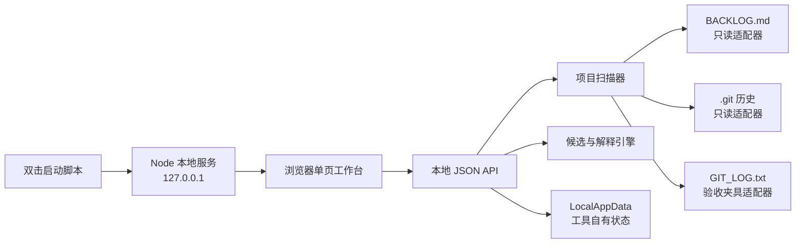

# 系统设计

## 设计目标

首个原型采用“本地 Node 服务 + 默认浏览器界面 + 双击启动脚本”。它必须能运行完整核心路径，同时把项目只读、全程离线和证据可追溯作为系统约束，而非仅靠文案承诺。

## 总体结构



## 技术边界

- Node 服务只监听 `127.0.0.1`，不得监听局域网地址；
- UI 静态资源随工具本地提供，无 CDN、字体请求、分析脚本或远程 API；
- 项目目录只允许读取，不允许创建缓存、锁文件或配置；
- 不调用 `git` CLI，也不在项目目录执行 shell、构建或用户脚本；
- 真实 Git 历史通过只读 Node 库（建议 `isomorphic-git` + Node `fs`）读取；
- `GIT_LOG.txt` 只服务当前非仓库验收夹具，结果中必须标记 `fixture-export`，不能对用户声称它是真实仓库扫描；
- 工具状态只写 `%LOCALAPPDATA%\StartWorkbench\state.json`（工作路径，可在实现时随正式命名调整）；
- 启动脚本可启动工具自己的 Node 服务和打开浏览器；Windows 文件夹选择器可由工具自有辅助脚本触发，这不授权执行任何项目命令。

## 文件夹选择

浏览器不能可靠返回 Windows 绝对目录路径给本地服务，因此原型采用两级方案：

1. “选择文件夹”调用工具自有的 Windows 文件夹选择辅助程序/PowerShell WinForms 对话框，返回用户明确选择的绝对路径；
2. 若系统策略阻止对话框，允许用户粘贴绝对路径作为可见降级路径。

辅助程序的工作目录必须是工具目录，参数中不得拼接或执行项目内容。返回值只作为待验证路径。

## 读取白名单

对选定根目录规范化后，扫描器只读取：

- `<root>\BACKLOG.md`；
- `<root>\.git\...` 中 Git 读取库需要的对象和引用；
- 当且仅当 `.git` 不存在时，读取 `<root>\GIT_LOG.txt` 作为验收夹具。

禁止递归扫描源码、设计文档或引擎文件。所有路径需在规范化后验证仍位于选定根目录内；符号链接/重解析点默认拒绝或不跟随。

建议限制：backlog 1 MiB、fixture log 1 MiB、近期 commits 20 条、单次扫描 3 秒软超时。具体数值可配置但必须有上限。

## 领域数据契约

```ts
type Role = "producer-design" | "programming" | "art" | "unrestricted";

type EvidenceRef =
  | { kind: "backlog"; file: "BACKLOG.md"; line: number; raw: string }
  | { kind: "commit"; hash: string; subject: string; source: "repository" | "fixture-export" };

type ProjectSnapshot = {
  snapshotId: string;
  project: { id: string; name: string; path: string };
  scannedAt: string;
  backlog: Array<{ id: string; text: string; line: number }>;
  commits: Array<{ hash: string; subject: string }>;
  gitSource: "repository" | "fixture-export" | "missing";
  warnings: string[];
};

type Candidate = {
  id: string;
  backlogItemId: string;
  title: string;
  rationale: string;
  lens: "risk-blocker" | "recent-continuity" | "role-goal" | "fallback";
  evidence: EvidenceRef[];
  riskOrBlocker: string | null;
  caveat: string;
};

type LocalState = {
  schemaVersion: 1;
  consentedAt: string | null;
  lastProjectPath: string | null;
  role: Role;
  todayGoal: string;
  lastDecision: null | {
    projectId: string;
    selectedAt: string;
    candidateSnapshot: Candidate;
  };
};
```

项目 ID 可由规范化路径的本地哈希生成；哈希仅用于本机状态关联，不上传。候选 ID 应由 snapshot 与 backlog item 稳定派生，避免刷新时无意义变化。

## 解析规则

### Backlog

原型只解析 `BACKLOG.md` 中以 `- ` 或 `* ` 开头的普通无序列表项：

- 忽略标题、空行和非列表段落；
- 保留原始文本与 1-based 行号；
- 同文重复项各自保留，使用行号区分；
- 不把 Markdown 复选框状态、嵌套列表或 frontmatter 解释成项目语义；遇到时产生兼容性提示。

### Git

真实仓库读取当前可达历史的最近 20 个 commit，输出短哈希与第一行 subject。首版不解析 diff、作者绩效、分支拓扑或源码内容。

验收夹具 `GIT_LOG.txt` 每行格式：

```text
<short-hash> <subject>
```

解析失败的行作为警告跳过；全部失败则该来源为错误，而不是空历史。

## 候选与解释引擎

### 处理管线

1. 对 backlog 和 commit subject 做大小写归一、标点切分和轻量词干处理；
2. 使用受控词表标注任务类型、风险、阻塞、角色相关性和领域实体；
3. 使用 token 重合与受控同义词建立 backlog—commit 关联；
4. 用相同方式匹配今日目标，但今日目标只加权，不替换事实证据；
5. 按风险/阻塞、近期连续性、角色/目标三个理由槽位各取一个不重复事项；
6. 生成模板化自然语言理由，并附引用；
7. 运行完整性检查：候选不重复、引用存在、理由中的每个事实均可回指输入；
8. 若不足 3 项，返回实际数量和明确原因。

### 受控规则示例

- `corruption`, `data loss`, `save` → 数据完整性风险；
- `crash`, `force-closing` → 稳定性风险；
- `investigate` → 未知根因/调查事项；
- `decide` → 决策阻塞；
- `camera`, `save`, `scene transition` → 程序相关性；
- `lighting`, `ambience`, `images`, `art` → 美术相关性；
- `tutorial`, `teach`, `playtest` → 制作/设计相关性。

关联措辞必须与证据强度匹配：token 或词表关联只能说“可能相关”，不能说“由该提交导致”。

### 确定性与多样性

相同 snapshot、角色、目标和跳过集合必须产生相同结果。平分时使用 backlog 原始顺序作为稳定 tie-breaker。角色不能成为排除条件；高损失风险项可跨角色进入候选。

## 本地 API 草案

| 方法 | 路径 | 用途 |
|---|---|---|
| `GET` | `/api/bootstrap` | 返回本地状态、隐私边界和服务版本 |
| `POST` | `/api/folder-dialog` | 打开工具自有 Windows 文件夹选择器 |
| `POST` | `/api/projects/scan` | 验证路径并生成 `ProjectSnapshot` |
| `POST` | `/api/candidates` | 根据 snapshot、角色、目标、跳过集合生成候选 |
| `POST` | `/api/decision` | 首次确认后写入用户选择快照 |
| `DELETE` | `/api/decision` | 清除上次选择 |
| `DELETE` | `/api/local-state` | 清除全部工具自有状态 |
| `GET` | `/api/health` | 启动脚本确认服务就绪 |

API 不接受任意文件路径读取请求，不提供 shell 或静态目录浏览接口。

## 状态写入

- 首次保存前 UI 请求一次明确确认；不同意时保持内存态，功能仍可用；
- 写入采用临时文件 + 原子替换，避免强退导致工具自身状态损坏；
- state 中保存候选快照，以便源 backlog 变化后仍能准确回顾“当时选择了什么”；
- 不保存完整 Git 历史或 backlog 副本，除 lastDecision 中必要的候选证据；
- 提供完整清除，清除后回到首次打开状态。

## 安全与隐私控制

- 启动时生成随机会话 token，浏览器 URL/API 请求携带 token；
- 校验 `Origin`/`Host`，拒绝非 loopback 请求，避免恶意网页调用本地 API；
- 默认端口被占用时选择另一个 loopback 端口，不结束未知进程；
- 响应设置禁止缓存敏感项目路径的头部；
- 日志默认不记录完整路径、backlog 内容或 commit subject；诊断模式需用户主动开启；
- 静态资源设置严格 CSP，网络层测试应证明无外连；
- 打开浏览器失败时打印本地 URL，不影响服务可用性。

## 模块建议

```text
src/
  server/          # loopback server, routing, session guard
  project/         # path validation, backlog and git adapters
  candidate/       # tokenizer, rules, slot selection, explanation
  state/           # LocalAppData schema, consent, atomic persistence
  ui/              # local static single-page UI
scripts/
  start.cmd         # double-click entry
  choose-folder.ps1 # tool-owned native picker, no project execution
tests/
  fixtures/
  unit/
  integration/
```

模块结构是建议，不要求在开工前创建空目录。

## 失败边界

系统不能声称：理解源码、知道团队真实优先级、识别任务依赖、判断某 commit 导致 bug、确认任务已完成。任何规则无法给出有意义理由时，应显示“证据不足”，而不是生成通用套话。
